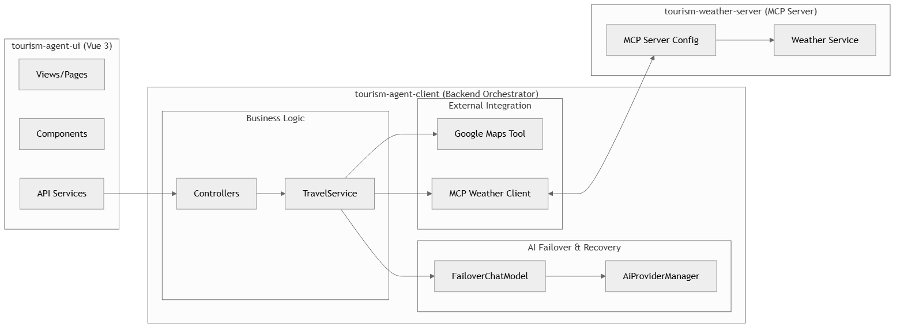
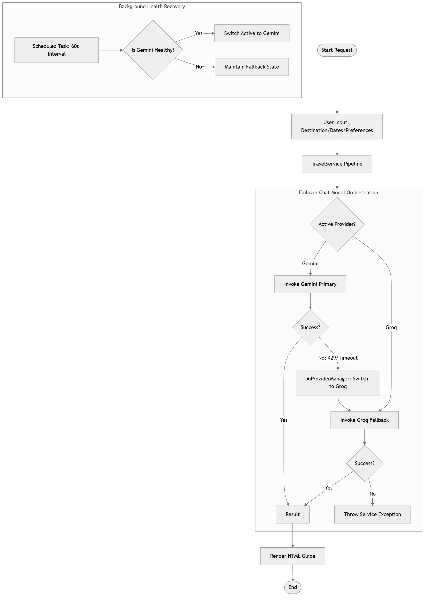

# Travel Buddy AI Assistant 🌍✈️

**Travel Buddy** is an intelligent AI-powered tourism planning agent designed to create highly personalized, professional travel itineraries. Built with **Spring Boot**, **LangChain4j**, and **Vue.js**, it leverages advanced Large Language Models (LLMs) and the **Model Context Protocol (MCP)** to provide real-time weather integration and global location insights.

---

## ✨ Features

- 🤖 **Multi-Model Intelligence** – Primary power by **Google Gemini 2.0 Flash** with seamless failover to **Groq (Llama 3)**.
- 🗺️ **Global Location Insights** – Integrated with **Google Places API** to find the best spots, hotels, and restaurants.
- 🌤️ **Real-Time Weather Integration** – Uses a dedicated **MCP Weather Server** for live destination weather context.
- 🎨 **Polished HTML Itineraries** – Generates beautiful, responsive, and print-ready HTML travel guides.
- 🛡️ **Robust Failover Mechanism** – Automatically switches AI providers during rate limits or service outages to ensure 100% availability.
- 📱 **Modern Responsive UI** – A sleek Vue 3 interface designed for both desktop and mobile exploration.

---

## 🏗️ System Architecture

Travel Buddy follows a modern decoupled architecture:



---

## 🛡️ AI Provider Failover Architecture

To ensure high reliability, the system implements a sophisticated failover and recovery logic that guarantees the application remains functional even if the primary AI provider is unavailable.

### Failover & Recovery Flow



1.  **Primary Provider**: All requests are initially routed to **Google Gemini 2.0 Flash**.
2.  **Detection**: If Gemini returns a retryable error (e.g., `429 Too Many Requests`, `Quota Exceeded`, or `Timeout`), the `FailoverChatModel` intercepts the exception.
3.  **Automatic Failover**: The system immediately switches to **Groq (Llama 3)** to fulfill the user's request without interruption.
4.  **Health Monitoring**: A background scheduled task (`@Scheduled`) performs periodic health checks on Gemini.
5.  **Auto-Recovery**: Once Gemini is confirmed to be healthy again, the `AiProviderManager` automatically restores it as the primary provider.

---

## 📋 Travel Planning Workflow

The agent follows a three-stage pipeline to ensure high-quality output:

1.  **Insight Generation**: Calls tools (Maps/Weather) to gather raw data and draft the itinerary.
2.  **HTML Transformation**: Converts the text itinerary into a structured, styled HTML document.
3.  **Structural Refinement**: Double-checks HTML tags, layout consistency, and responsive styling.

---

## 🛠️ Technology Stack

### Backend
- **Framework:** Spring Boot 3.4.5
- **AI Orchestration:** LangChain4j 1.0.1 (Core), 1.0.1-beta6 (Gemini & MCP)
- **MCP Implementation:** Spring AI 1.1.0 (Weather Server)
- **Language:** Java 21

### Frontend
- **Framework:** Vue 3.5.13 + Vite 6.2.4
- **UI Library:** Element Plus
- **State Management:** Pinia
- **HTTP Client:** Axios

---

## 🚀 Installation & Setup

### Prerequisites
- **Java 21**
- **Node.js 20+**
- **API Keys:** Gemini API Key, Groq API Key, Google Maps API Key, QWeather Key.

### 1. Weather MCP Server
```bash
cd tourism-weather-server
# Configure application.properties with QWeather Key
mvn spring-boot:run
```

### 2. Agent Client
```bash
cd tourism-agent-client
# Configure application.properties with AI and Maps Keys
mvn spring-boot:run
```

### 3. Frontend UI
```bash
cd tourism-agent-ui
npm install
npm run dev
```

---

## 🔮 Future Enhancements
- [ ] **PDF Export:** Allow users to download their itineraries as PDF files.
- [ ] **Multi-Language Support:** Generate guides in any language requested by the user.
- [ ] **Persistence:** Save user history and favorite itineraries using PostgreSQL.
- [ ] **Interactive Maps:** Embed live Google Maps in the generated HTML.

---

## 📄 License
This project is licensed under the MIT License - see the [LICENSE](LICENSE) file for details.

---

## 📬 Contact & Support

If you find this project useful, I'd love to hear from you!

- **LinkedIn**: [Sundaram Verma](https://www.linkedin.com/in/sundaram22verma/) 🔗
- **Show your support**: If you use this project in your own work, please consider giving it a **Star** ⭐ and a shoutout on LinkedIn! I'd love to see what you build.
- **Project Link**: [GitHub Repository](https://github.com/sundaram22verma/AI-Tourism-Assistant-Agent)
