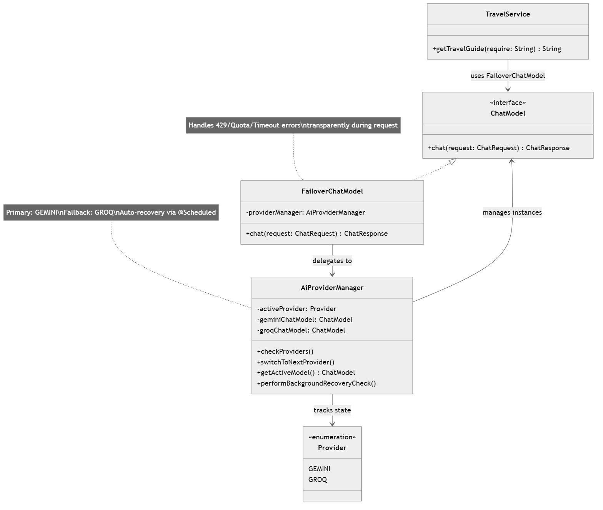
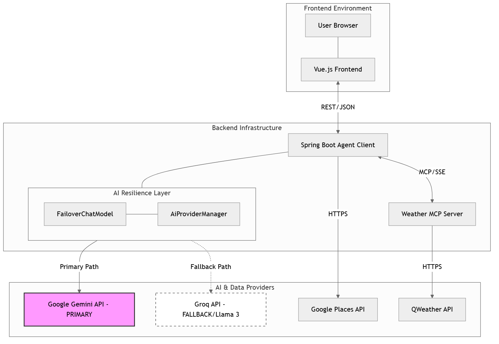
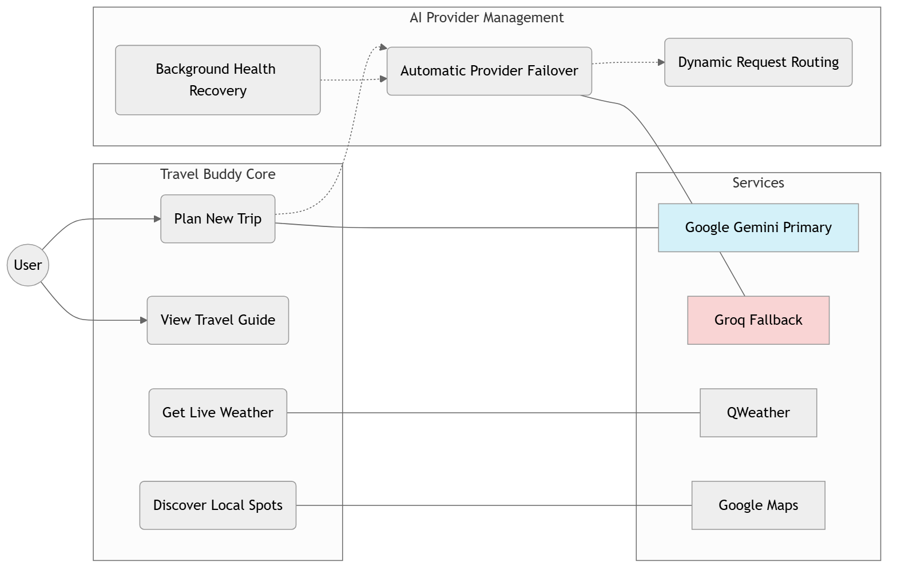

# Travel Buddy Technical Documentation

## 1. System Overview

**Travel Buddy** is a sophisticated AI agent system built on the **Model Context Protocol (MCP)** and **LangChain4j**. It orchestrates multiple AI models and external tools to deliver comprehensive travel planning services.

### Core Architectural Pillars
- **Resilience**: Dual-provider failover (Gemini/Groq) ensures high availability despite API rate limits.
- **Extensibility**: Tool-based architecture allows easy integration of new data sources (Maps, Weather, etc.).
- **Consistency**: A multi-stage generation pipeline guarantees structural integrity and aesthetic quality of the final report.

### Technology Stack
- **Backend**: Java 21, Spring Boot 3.4.5
- **AI Framework**: LangChain4j 1.0.1 (Core), 1.0.1-beta6 (Gemini & MCP)
- **MCP Implementation**: Spring AI 1.1.0 (Weather Server)
- **Frontend**: Vue 3.5.13, Vite 6.2.4, Element Plus, Pinia, Axios.

---

## 2. Component Deep Dive

### 2.1 AI Agent Client (`tourism-agent-client`)
The central orchestration hub, responsible for:
- **Provider Management**: `AiProviderManager` tracks the health of Gemini and Groq.
- **Failover Logic**: `FailoverChatModel` intercepts errors (429, 503, timeouts) and transparently retries requests with the fallback provider.
- **Tool Orchestration**: Integrates `GoogleMapsTool` for local discovery and `McpClient` for weather data.

#### Class Diagram

#### Failover Mechanism
1. **Primary**: Google Gemini 2.0 Flash (Optimized for reasoning and tool use).
2. **Fallback**: Groq / Llama 3 (Ultra-fast inference, used during Gemini outages).
3. **Routing Logic**: The `FailoverChatModel` wraps the active `ChatModel`. It catches `429` (Quota) or `503` (Unavailable) exceptions and triggers an immediate switch to Groq.
4. **Recovery**: A background scheduled task (`@Scheduled`) checks Gemini health every 60 seconds. If recovered, the system switches back to the primary provider.

### 2.2 Weather MCP Server (`tourism-weather-server`)
A standalone service following the **Model Context Protocol**:
- **Role**: Serves as a "Skill" provider for the AI agent.
- **Implementation**: Built with **Spring AI**'s MCP server implementation.
- **Provider**: QWeather (Hefeng) API for global real-time weather data.
- **Communication**: Exposed via Server-Sent Events (SSE) at `http://localhost:9000/sse`.

### 2.3 Frontend Application (`tourism-agent-ui`)
A modern SPA built with **Vue 3**:
- **State Management**: Uses Pinia for managing session-level travel data.
- **Rendering**: Implements a specialized `TravelPlanViewer` that safely renders AI-generated HTML within a scoped environment.

---

## 3. Deployment Architecture

The system is designed for high modularity. The Frontend, Agent Client, and Weather Server can be deployed independently as microservices or containers. The "AI Resilience Layer" ensures that backend failures in the primary AI provider do not affect the user experience.

---

## 4. Data Flow & AI Pipeline

The `TravelService` executes a 3-step pipeline to generate a guide:

| Stage | Assistant | Purpose |
| :--- | :--- | :--- |
| **1. Insight Generation** | `ToolAiAssistant` | Calls tools (Maps/Weather) to gather raw data and draft the itinerary. |
| **2. HTML Transformation** | `NormalAiAssistant` | Converts the text itinerary into a structured, styled HTML document. |
| **3. Structural Refinement** | `NormalAiAssistant` | Double-checks HTML tags, layout consistency, and responsive styling. |

---

## 5. Use Case Overview

The system focuses on a seamless planning experience where the complexity of AI model management and tool orchestration is hidden from the user.

---

## 6. Configuration & Deployment

### Environment Variables
For production security, it is recommended to use environment variables instead of hardcoded values in `application.properties`:

| Variable | Description |
| :--- | :--- |
| `TRAVEL_AI_GEMINI_KEY` | Google Gemini API Key |
| `GROQ_API_KEY` | Groq API Key |
| `GOOGLE_MAPS_API_KEY` | Google Places/Maps API Key |
| `HEFENG_API_KEY` | QWeather API Key |

### API Endpoint Reference
- **Endpoint**: `GET /api/v1/travel/chat`
- **Query Param**: `content` (The full prompt string)
- **Response**: `text/html` (The final refined travel guide)

---

## 7. Troubleshooting & FAQ

- **Q: Why does the generation take 20-30 seconds?**
  - A: The system performs three distinct LLM calls and multiple tool executions (Maps + Weather) to ensure the highest quality HTML report.
- **Q: Gemini is returning 429 (Rate Limit).**
  - A: The `FailoverChatModel` will automatically switch to Groq. Check the logs to confirm: `Gemini AI provider failed... Switching to Groq for failover request`.
- **Q: Weather data is missing in the guide.**
  - A: Verify the `tourism-weather-server` is running and accessible at the URL defined in `McpConfig.java`.
